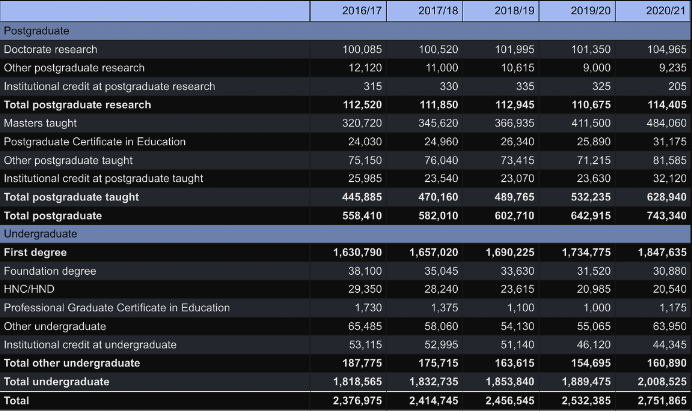
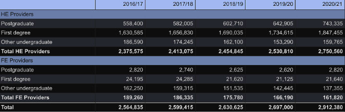
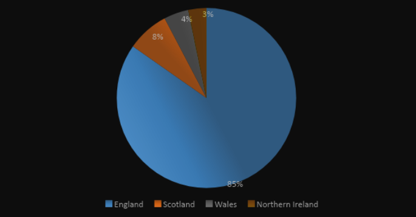
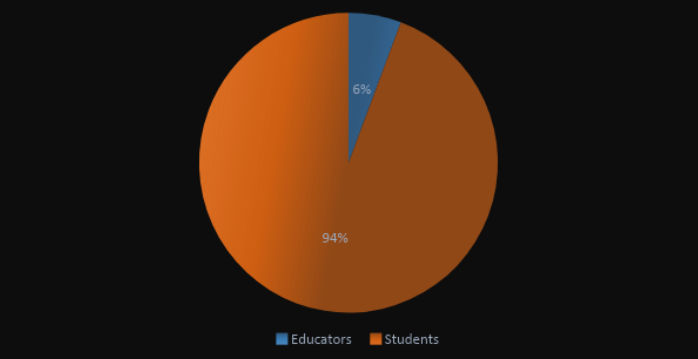
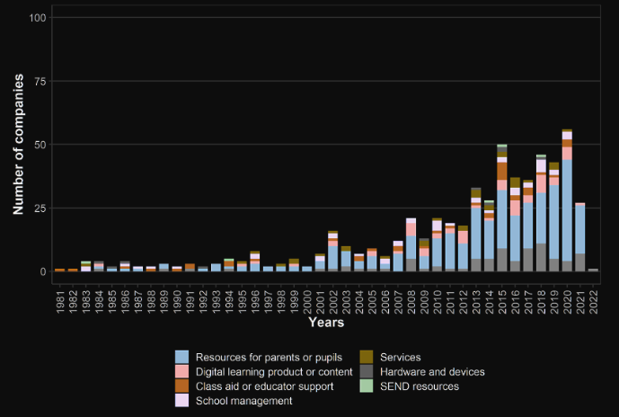
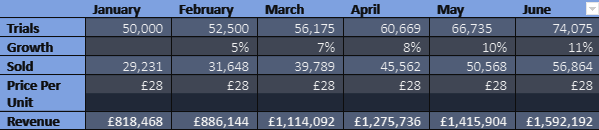
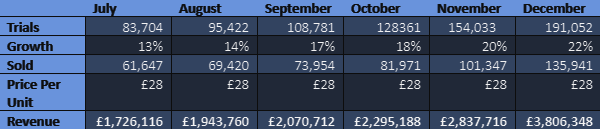

<h1>Marketing Plan</h1>

<h2>Customers</h2>

The report system is aimed to be delivered directly to educational institutions that deal with the management of data
for students which professors, teachers, lecturers and more use to analyse student data.

Demographic Profile of a Teacher
Male and Female
Aged 18-60
United Kingdom

The product provided is an education management tool. Where the main purpose of this software is to display the status report of the student and the whole class, as the institute's administration needs to keep track of all its students and their performance in their modules. Additionally, the software introduces all information related to the students where the admin of the software could access the student's ID, progress report, class performance, and class difficulty, and it’s also possible to export the result as a PDF.

When developing the software, our team performed secondary research by investigating the demographics of our potential market. Moreover, we also considered the type of education provided, the quality of technology used in the UK, and the size of the institutes. Whereas the UK has a total of 32,226 (Statista, 2021) schools and an estimated 164 universities (Clark, 2017). The education sector has witnessed a growth in the number of enrolments between the years 2019/20 and 2020/21. Where Higher Education (HE) experienced a growth of 9% overall which includes a total of 2,912,380 students, specifically, a 10% growth in first-year enrollments. As for the Further Education (FE), postgraduate students, there was an increase from 23% to 27%, which was the first time the HE would experience since 2016/17.

Moreover, there’s a total of 624,520 educators around the UK. The percentage of educators is approximately 6% compared to the total number of students (Figure 4). This provides a clear image of how much the technology provided needs to be advanced to assist education staff in managing their classes and institutes. Nevertheless, this would also need to depend on the institute’s budget and the methodology of training those staff and using this type of technology. Software developers need to perform a relevant software charge/subscription with respect to their competitors in the market. These are some of the factors that would affect the way institutes would select their education management tool providers.

 

Figure 1. Higher Education Statistics Agency (2020)

 

Figure 2. www.hesa.ac.uk (2021)

<h2>Economics</h2>

According to Statista (2021) and Clark (2017), the total size of the market is 32,390 which consists of 32,226 schools and an estimated 164 universities Moreover, the total number of students across the UK reached 10,320,181. While there’s a total of 624,520 teachers across the UK, which implements an approximate percentage of 6.05%. All of which, prefer to use the most recent available technology in managing their institutes as it makes the process more automated. Yet, these institutes are divided into two groups which are private institutes and public ones. Where public institutes are funded by the government. Hence, many of these institutes either have good quality technology or cannot afford an automated type of technology that provides explicit details about the students and their modules. Therefore, the percentage of our market share could be affected depending on the budget of these institutes.

 

Figure 3. Number of students across the UK

 

Figure 4. Percentage of Educators against students

Based on our observation of the market and following a few articles, the educational sector requires more sophisticated technology. Where it’s projected that the educational sector will be growing at a rate of 6.91% annually till 2027. The educational sector is also projected to generate a market volume of $440 million U.S. Dollars which is also approximately £365 million. Furthermore, the Edtech industry generated an estimated total market revenue of £3.8 billion in the year 2021. Consequently, the industry expects more students to join, thus institutes would require an automated system in recording all related data. Overall, the education industry develops a promising growth strategy which could be a good potential for our team’s educational management tool. Relatedly, the latest technology observed in the market such as Gradelink contains functionalities such as an Online payment system, lesson planning, designing report cards, and other features. Other platforms such as MyClassCampus have similar features including a report card generation system, lesson planning all-in-one shared calendar, admission management, etc. However, both platforms have a few disadvantages where Gradelink consumes longer time in learning about the platform. Yet, the software would be simple to use once the user completed his/her training on it. On the other hand, MyClassCampus is expensive for smaller educational institutes and might be not user-friendly as it’s listed as one of the most complex platforms in the market. Other platforms such as Vidyalaya hold many interesting features such as online payments and being affordable. Yet, the software lacks customizing report card features.

As a team who is developing educational management software that contributes to organizing and keeping track of the students and their performances alongside observing the module difficulty, we primarily target a share of 5.26% of the market. Where our team aims to generate a profit of £200 million pound. According to Department for Education (2019), the government is aiming “development of a vibrant EdTech business sector in the UK to provide proven, high-quality products that meet the needs of educators and foster a pipeline of fresh ideas” (Department for Education, 2019). With the given percentages, educators need to use the latest tools available in managing their student data as it would simplify the process. The figure below displays the number of companies that are established per year in the EdTech industry. Where it’s noticeable that throughout the years 2021 and 2022, there no companies were established related to school management. This creates a better opportunity for our team to introduce new ideas into the market and potentially gain more clients throughout the process. Furthermore, schools would prefer selecting newly established companies as the process could potentially be less expensive.

 

Figure 5. Number of companies by established year.

<h2>Competition</h2>

Our education management tool will face competition from several other companies that are offering similar products and services. Our major competitors within this space include companies like Moodle, Google Classroom and Canvas LMS who all provide the most popular grading systems. These products have already been well established in the market and have a large and loyal customer base.

Our competitors will offer a wide range of products and services to different customers all over the world having a wider reach, however, some services provided by different educational management tools might be more prominent in specific markets or regions. One competitor may decide to focus on specific features such as course and content management which would be more useful for a specific region, whereas other competitors may focus on features such as Student management which would be more beneficial to a wider range of customers in a larger region.

There will be a couple important indirect competitors with other educational technologies and services that offer similar solutions. These can include older and more traditional grading systems which may not be as user-friendly or as efficient as our digital counterpart. There also other systems which are not education management tools but may have overlapping features with our product such as software designed specifically to track student attendance. Other indirect competitors can include things such as online tutorial services and course providers.

Our product will be designed to be user-friendly and intuitive. We can achieve this by utilizing good design trends & practices in UI design. We can also provide customization options to allow the customers to easily select which information they want to be displayed to them more frequently. This is a way to allow the customer to tailor the platform to their specific needs. These features aid in broadening our customer base. This also makes it easier for our target market to use. Competitive pricing will also help to make our system more accessible & affordable to a wider range of educators and institutions than systems that are currently already well established in the market.

<h2>Product, Price, Promotion & Place</h2>
<h3>Product</h3>

Our educational management system is a software made up of various utility features that enables educators and administrators to manage information on students’ progress and grades towards their modules. The software is designed to present the administrators with data which is structured and displayed in an organised way using graphs and charts. It also allows the end user to tailor the platform to their specific needs so they may see whichever information they require at any time.

<h3>Price</h3>

The pricing strategy for our educational management system is to be as affordable and competitive as possible whilst still generating enough revenue to sustain the business and keep the project going. The pricing can be based off the level of features and support we provide through our software along with the number of users. The price will be compared to the products readily available on the market. A lower competitive price means increased sales and revenue as the product would be more attractive to customers.

<h3>Promotion</h3>

We can promote our product through digital marketing tactics. This includes various methods, one of which being social media. Social media can be used utilising social media platforms such as Facebook, Instagram, and Twitter. We can share our product and services with the public through these platforms and engage with users through different tactics to build a large following. Social media marketing will aid in building a larger brand awareness and ultimately drive more traffic to our final product. Another way to promote the product would be through free trials and offering demos to potential customers to allow people to get a feel for our product.

<h3>Place</h3>

A way of making our product available is through a custom website where we can sell our product on a global scale. A website allows us to sell to customers all over the world. The page would provide great convenience as anyone can see everything they need to about the product in one location. A webpage can also aid in improved customer engagement. It provides another platform for us to engage with our customers, answer any questions and provide them with valuable information. Using a webpage also greatly aids in building our own brand and establish credibility.

<h2>Sales Forecast</h2>
1st Half of 2023
   
2nd Half of 2023
 

<h2>Reference list</h2>
10Duke. (2023). Proprietary Software License | Definition. [online] Available at: https://www.10duke.com/resources/glossary/proprietary-software-license/ [Accessed 8 Mar. 2023].  
Aston, J., Davies, E., Guijon, M., Lauderdale, K. and Popov, D. (2022). The education technology market in England Research report. [online] Available at: https://assets.publishing.service.gov.uk/government/uploads/system/uploads/attachment_data/file/1117067/Edtech_market_in_England_Nov_2022.pdf.    
BESA (2020). Key UK education statistics - BESA. [online] BESA. Available at: https://www.besa.org.uk/key-uk-education-statistics/.   
Clark, D. (2017). Number of universities in the UK 2000-2017  | Statista. [online] Statista. Available at: https://www.statista.com/statistics/915603/universities-in-the-united-kingdom-uk/.   
cpl.thalesgroup.com. (n.d.). Proprietary Software License | Thales. [online] Available at: https://cpl.thalesgroup.com/software-monetization/proprietary-software-license#:~:text=A%20proprietary%20license%20model%20is.    
Department for Education (2019). Realising the Potential of Technology in education: a Strategy for Education Providers and the Technology Industry. [online] Available at: https://assets.publishing.service.gov.uk/government/uploads/system/uploads/attachment_data/file/791931/DfE-Education_Technology_Strategy.pdf.    
Dependency Heaven. (2021). Open Source Software Licenses 101: The LGPL License - FOSSA. [online] Available at: https://fossa.com/blog/open-source-software-licenses-101-lgpl-license/#:~:text=The%20LGPL%20License%20(both%20versions [Accessed 8 Mar. 2023].    
GDPR-Text.com | GDPR Text, Translation and Commentary. (2019). Article 9  GDPR. Processing of special categories of personal data | GDPR-Text.com. [online] Available at: https://gdpr-text.com/read/article-9/. 
GOV.UK (1998). Data Protection Act 1998. [online] Legislation.gov.uk. Available at: https://www.legislation.gov.uk/ukpga/1998/29/contents.    
Higher Education Statistics Agency (2020). Higher Education Student Statistics: UK, 2020/21 - Student numbers and characteristics | HESA. [online] Hesa.ac.uk. Available at: https://www.hesa.ac.uk/news/25-01-2022/sb262-higher-education-student-statistics/numbers.    
ico.org.uk. (2022). About the DPA 2018. [online] Available at: https://ico.org.uk/for-organisations/guide-to-data-protection/introduction-to-dpa-2018/about-the-dpa-2018/#:~:text=The%20DPA%202018%20sets%20out%20the%20framework%20for%20data%20protection.    
Kimberly Bond (2018). Copyright Law Basics For UK Software Developers — Smashing Magazine. [online] Smashing Magazine. Available at: https://www.smashingmagazine.com/2018/03/copyright-law-basics-for-uk-software-developers/.    
sites.google.com. (n.d.). Copyright Regulations 1992 - jlowe16113. [online] Available at: https://sites.google.com/site/jlowe16113/exam-notes/copyright-regulations-1992 [Accessed 8 Mar. 2023].    
Statista. (n.d.). Education - United Kingdom | Statista Market Forecast. [online] Available at: https://www.statista.com/outlook/dmo/app/education/united-kingdom#:~:text=Total%20revenue%20in%20the%20Education.    
Statista. (2021). Schools in the UK 2019. [online] Available at: https://www.statista.com/statistics/283575/number-of-schools-in-the-united-kingdom/.    
Universities UK (2021). Higher education in numbers. [online] Universities UK. Available at: https://www.universitiesuk.ac.uk/latest/insights-and-analysis/higher-education-numbers.    
www.consilium.europa.eu. (n.d.). The general data protection regulation. [online] Available at: https://www.consilium.europa.eu/en/policies/data-protection/data-protection-regulation/#:~:text=data%20protection%20rules-.    
www.hesa.ac.uk. (2021). Figure 4 - HE student enrolments at HE and FE providers by level of study and HE provider type 2016/17 to 2020/21 | HESA. [online] Available at: https://www.hesa.ac.uk/data-and-analysis/sb262/figure-4.    
www.nidirect.gov.uk. (2015). Freedom of information and data protection | nidirect. [online] Available at: https://www.nidirect.gov.uk/articles/freedom-information-and-data-protection#:~:text=Freedom%20of%20information%20(FOI)%20gives [Accessed 8 Mar. 2023].    
www.tutorialspoint.com. (n.d.). JFreeChart - Quick Guide. [online] Available at: https://www.tutorialspoint.com/jfreechart/jfreechart_quick_guide.htm#:~:text=JfreeChart%20is%20an%20open%20source [Accessed 8 Mar. 2023].    
