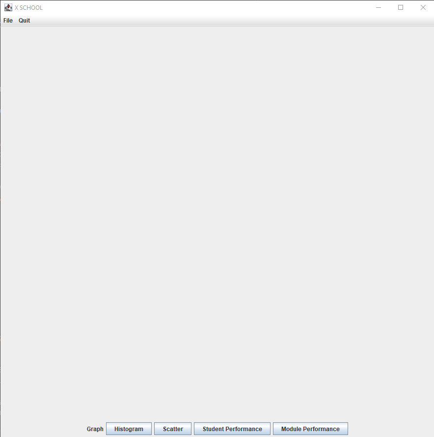
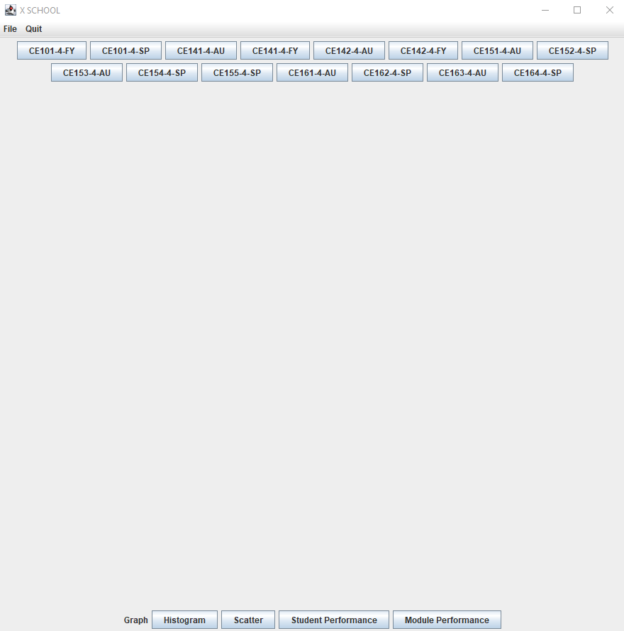
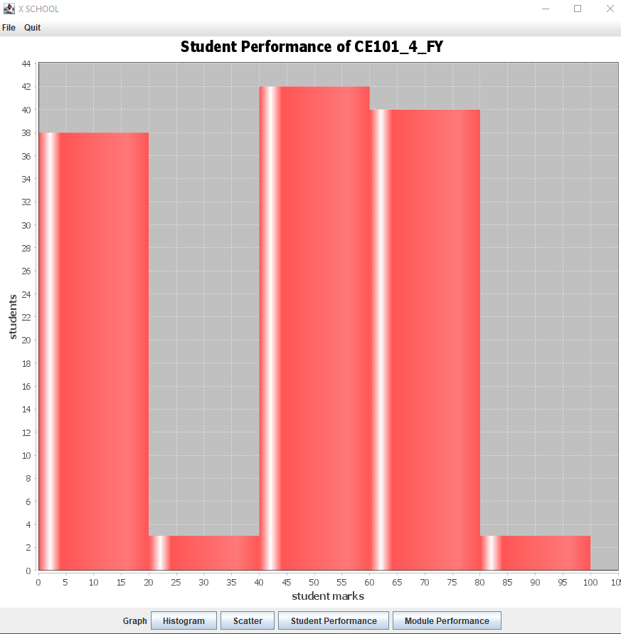
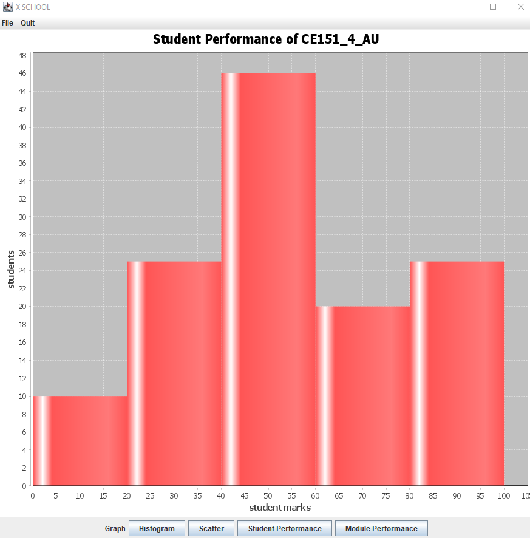
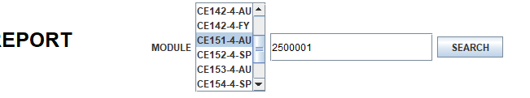
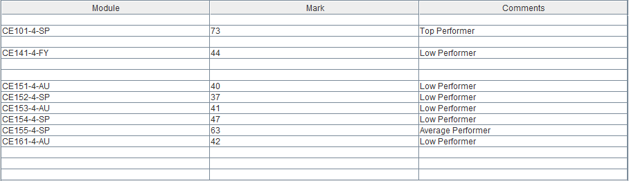

<h1>MVP Demonstration</h1>

 

Upon starting the application, this is the following window that is shown. A blank center slate
with a top and bottom menu bar display types of graph options, clicking quit exits the program and
file -> save as saves the center image as a PNG. Currently student performance and module performance
are incomplete. The save as button saves a blank image even if no graph is currently showing which in
the final version we wish to only let the user save as if a graph is showing. Moreover with no graph
showing in the starting screen, it appears very blank and lifeless, in the final version we would like
to improve the visuals as well as provide tooltips to point the user in the right direction, for
instance in the center show a title "No graph displayed".

 

Upon clicking on the "Histogram" option the following screen shows the different modules as buttons
to be selected to filter the histogram graph based upon module selection. Every module from every course
is displayed as an option and can dynamically change based upon the dataset given to the program. Though
the position of the buttons is likely to change by the final product by being positioned closer to the
action buttons at the bottom of the screen closer to the users mouse.

 

Selecting the CE101_4_FY button from the top menu creates and displays a histogram graph from the
dataset based upon the selected module, only displaying students and marks achieved in the CE101_4_FY
module. This graph displays the modules name in the title dynamically, the student marks on the X axis 
and student frequency on the Y axis. The bars are separated by 5 different classes of performance with 
80-100 being first class, 60-80 being upper-second class, 40-60 being lower-second class, 20-40 being 
third class and 0-20 being fail. In the future for our final version, we would like to clarify the
different performance category's in the X axis of the chart so that the user can easily identify how
many students are in each class bracket.

 

This shows how after selecting a different module to display, the chart dynamically displays the 
fresh data however it requires having to exit and loading the application back up to return to the 
module select screen, for the final version of our application we would like to keep the module menu
permanently in the window so the user can select various modules and the graph updates in realtime.

<h1>Final Product Demonstration</h1>

 

When loading the finished application for the first time, the application prompts the user to upload a
txt or csv file with valid formatting, this is the data file that contains the student data that the user will
need to upload, if the user had already uploaded the file, the next time the program is launch it will remember
the file that was uploaded and loads it automatically.

 

Accessing the file button in the top left corner and selecting "upload file" opens a file chooser window allowing
the user to navigate their system file to find the data file.

 

This is a focused look at the file chooser window once the user has navigated to the data file that wants to
be uploaded, selecting the file and clicking the open button will open the data file into the report to be read.

 

Upon opening the selected file, the file is read by the program and the user interface will update with a module
selection list generated from the formatting of the file, with a "create report" button.

 

The user can select one or multiple items in the module list like a standard list holding ctrl and right clicking the 
mouse, here after scrolling down the list I have selected 3 modules and clicked the "create report" button to process
the data

 

After clicking the "create report" button, the program returns the data found in the selected modules based on various
characteristics with subheadings to show what information is being displayed.

 

Taking a closer look at the student performance table, the table is scrollable and ordered by top performers to low
performers displaying marks, course and the students ID all in a singular table. The table is calculated dynamically which
is relative to the average student score, this calculation is done by taking the average student score across all selected
modules and creating an upper and lower boundary where low and high performers can be categorized with average between.

 

This table represents the modules difficulty with no particular ordering including the module, difficulty and the average
mark achieved in the module as fields. Similar to the student table, the difficulty is predicted dynamically by considering
the average score achieved across all modules and creating an upper and lower boundary using the difference between the
overall average and the lowest average/highest average with average between the boundaries, the charts heading displays the
boundaries to the user.

 

This histogram displays the distribution of student marks across the amount of students in all selected modules, colour
keyed per module with overlapping colour. Total amount of students displayed in the header represented by 5 bins showing the
the first class, upper-second class, lower-second class, third class and fail.

 

This scatter graph displays the student mark as the independent variable compared to the student average mark across
all modules with each datapoint representing a student in the colour keyed module with all selected modules being shown
on the scatter plot. The linear regression line represents the predication of a students performance based upon other
students marks.

 

Back to our search bar at the top of the page, if the user had wanted to search for a specific students performance statistics
per module, the user is able to type a 7 number ID into the search field which the system will try to find the entered ID in
the data file, if it is valid the following details are displayed. If it is not a valid ID the user is notified and nothing
happens.

 

Here is the table displayed after a valid ID is found when the user presses the search button, it shows each module the user
takes as well as their achieved mark and performance bracket. The performance bracket is calculated the same way as the traditional 
student performance table when searching by module, by considering the average mark achieved by all students that takes the module
as well as the highest mark and the lowest mark achieved within that module, the highest mark is used by halving the difference
between the average and the highest mark, while the lowest mark is used by halving the difference between the average and the lowest
mark to get the top and low performing boundaries.

 

This save window accessed from the top bar menu under the file dropdown button named "Save as PDF" shows a file chooser screen that the user
can navigate through a file explorer to choose a location and file name to save to a PDF file.

 

This is the opened PDF document after saving the report to the PDF file, displaying the student performance table
across multiple pages as displayed in the application. The module table is displayed below the student table on a new 
page with sub headings for each section.

 

This image is further scrolled down the PDF document displaying both the histogram and scatter plot graphs on seperate
pages as images as exactly how they look from the report.

