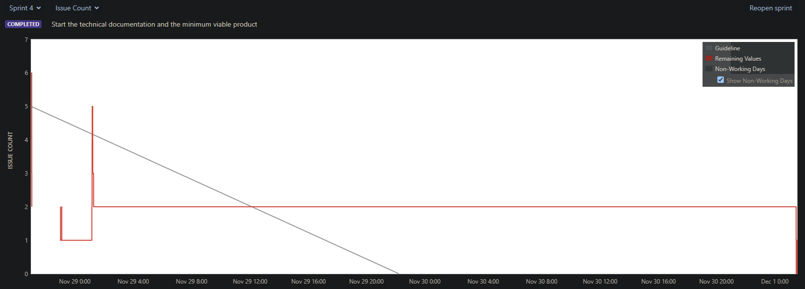

<h1>Project Management</h1>

During our first week of the team project, we had all made an effort to get to know one another and agree upon using
a system such as whatsapp to collaborate and communicate effectively. We all had an understanding of the foundations of
what makes a team successful, and therefore we had ensured that attending the labs was a priority so that we could meet
in person on a weekly basis to grow a strong relationship while also using the time in labs as an opportunity to discuss
the projects scope and any problems we faced during scrum meetings dramatically helping everyone understand and visualize
their tasks deliverables and requirements. As our team managed to attend to the majority of the lab sessions we were
able to build a solid relationship discovering the strengths and weaknesses of each member. Being aware of each other's 
capabilities and the groups capabilities in general, we have been able to distribute the workload based upon who could 
complete the given task at the best standard in a timely manner which has lead to overall efficient work rates although 
many of our tasks have not been completed on time and had to be extended, nobody was overworked keeping our team inspired
and motivated.

Although the team as a whole has a strong commitment to the labs, our team members lived very far away from the campus 
which made arranging time outside the labs to meet in person almost impossible, so we could not meet in person as much 
as we would have wanted to which could have affected the projects' efficiency as we couldn't support each other directly 
in person on our tasks where whatsapp was too asynchronous.

During the project development lifetime, we held our scrum meetings during the labs to discuss a team plan for the 
future week planning the sprints contents and what foreseeable issues could impact the sprint. Holding scrum meetings
has helped our team complete the project deliverables quickly and efficiently as encouraging a discussion on the project
ensures everyone is up-to-date on the projects scope and understands the teams goals, realizing the obstacles that could
impact work enabled us to plan ahead and organise our sprint to eliminate distributions. Although our current project
management routine is working effectively, it would be even more efficient if we could hold more frequent scrum meetings
so our team could be informed of new unforeseen issues that may impact the sprints scope. Holding a sprint retrospective
at the end of each sprint during a scrum meeting would also benefit our team by identifying the flaws of our last sprint
so we could make an effort in improving the efficiency of the next sprint.

Standup Meetings  
<https://cseejira.essex.ac.uk/browse/C201165-104>
<https://cseejira.essex.ac.uk/browse/C201165-105>
<https://cseejira.essex.ac.uk/browse/C201165-122>

We had started performing standup meetings later into the development of the project as we felt that as the project
headed further into more technical development there needed to be more clarity on what has and hasnt been completed so
we could move forward on the project as a team more efficiently. Though the team was very inconsistent on turning up to
the planned standup meetings, at times it was especially helpful to be able to record what functionality was completed
in respect to my tasks so that future tasks could be planned more accordingly, such as at one point the PDF reader had 
bugs needed to be ironing out that was breaking the functionality and documenting what kind of bugs we faced was helpful
in the further weeks sprint to look back on to fix.

<h2>Sprint Burn-down Chart</h2>
<h3>SPRINT 1</h3>

<h3>SPRINT 2</h3>

<h3>SPRINT 3</h3>

<h3>SPRINT 4</h3>

<h3>SPRINT 5</h3>

<h3>SPRINT 6</h3>

Standup Meeting - <https://cseejira.essex.ac.uk/browse/C201165-104>
<h3>SPRINT 7</h3>

Standup Meeting - <https://cseejira.essex.ac.uk/browse/C201165-105>
<h3>SPRINT 8</h3>

Standup Meeting - <https://cseejira.essex.ac.uk/browse/C201165-122>

The burn-down charts plotted on a per-issue basis shows our team that during sprint 1 and sprint 2, we had not completely
finished the issues causing the issues' deadline to be extended to the next sprint, this is partly because we had initially
in the first 2 sprints created singular issues with individual sub-tasks meaning every sub-task had to be completed 
by the assigned team member before the overall issue could be moved to "done". Since a team member did not complete their
assigned sub-tasks in the first 2 sprints the charts give the impression that we had not completed a single task in the
first 2 sprints. Our graphs later improved beyond sprint 3 as we began creating individual issues for each task, however
sprint 3 shows that our completed task was not on track with the ideal line, tasks were still slow to be completed and 
were often moved into the next weeks sprint. In future sprints, we will assign time estimates to each task created in jira
and make a conscious effort to ensure the task is moved to in progress if the task is currently being worked on as from
what we could tell from our burn-down chart, it is difficult to estimate how long a task took to be completed as it shows
as being instantly completed instead of gradually overtime.

<h2>Product Backlog</h2>

